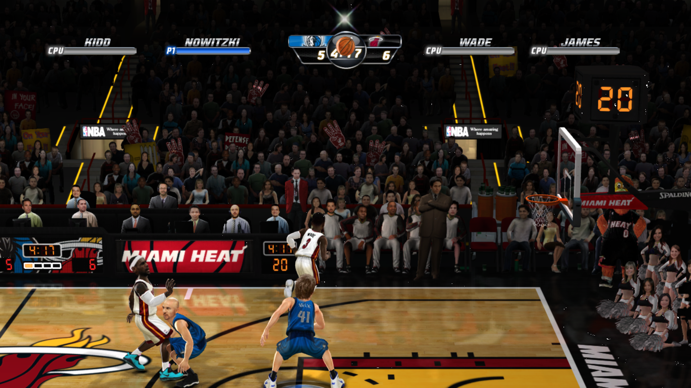

# OpenJam

A native PC port of **NBA JAM: On Fire Edition** (Xbox 360, XBLA, 2011), built
with [ReXGlue](https://github.com/rexglue/rexglue-sdk). Not an emulator: the
original PowerPC code is statically recompiled to C++ ahead of time and compiled
for x86-64.

**It runs and it plays.**

## What this repository contains

The port project only — the configuration, hand-written source, and the tooling
built along the way. It contains **no game content**. You need your own copy of
the title; the build reads an extracted XBLA package and never redistributes it.

| Path | What it is |
| --- | --- |
| `nbajam_ofe_manifest.toml` | Entry point for codegen |
| `nbajam_ofe_config.toml` | Hand-derived function boundaries |
| `nbajam_ofe_gaps.toml` | Functions recovered from gaps discovery missed |
| `src/` | Kernel stubs, diagnostics, the app class |
| `tools/` | Gap recovery and guest-debugging tooling |
| `templates/` | One codegen template override |

`generated/` (≈166 MB, 5.7M lines) and `out/` are reproducible and not tracked.

See **[BUILDING.md](BUILDING.md)** for the toolchain, the build, how to run it,
and a full account of every local change and why it exists.

## Status

Boots to gameplay. Roughly 53,000 recompiled functions register with none
rejected; all 320 kernel imports resolve; graphics, audio, input and the
achievement store all initialize.

Known rough edges: the Xenos backend logs a stream of "invalid" texture fetch
constant warnings during play, and `memmap:\clips\` is unmapped.

## Notes

The eventual target is an original Xbox port, which inverts most of the
constraints — 64 MB unified memory against the 360's 512 MB, one 733 MHz
Pentium III against three 3.2 GHz PowerPC cores, fixed-function-era shaders
against the Xenos. This PC build exists to establish a correct reference to diff
against.

Not affiliated with or endorsed by EA, the NBA, or Microsoft. For preservation
and educational purposes.
