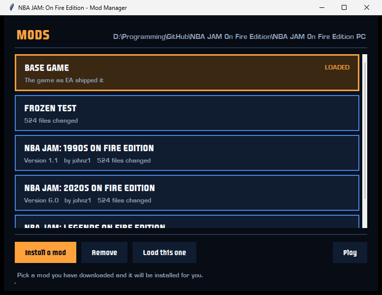
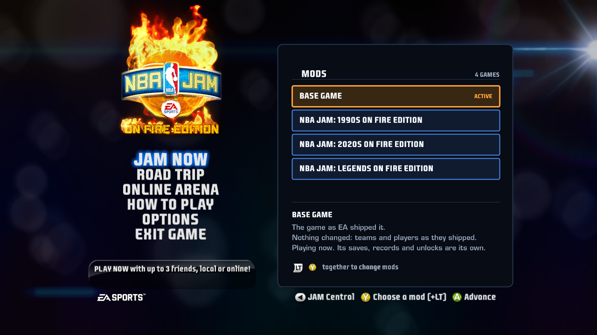
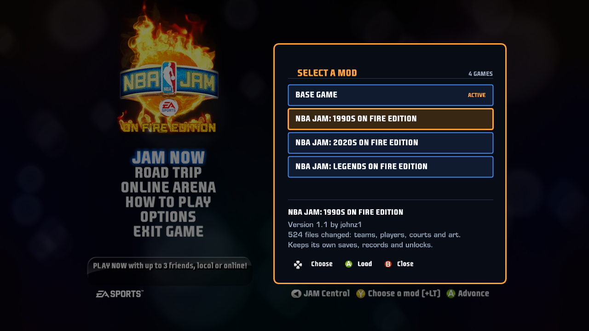
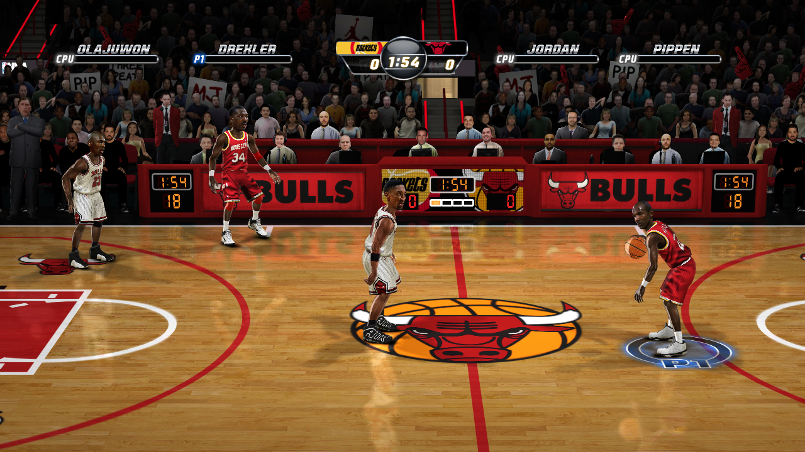

# OpenJam

A native PC port of **NBA JAM: On Fire Edition** (Xbox 360, XBLA, 2011), built
with [ReXGlue](https://github.com/rexglue/rexglue-sdk). Not an emulator: the
original PowerPC code is statically recompiled to C++ ahead of time and compiled
for x86-64.

**It runs and it plays.**

## Playing it

You need your own copy of the game. NBA JAM: On Fire Edition was sold on Xbox
Live Arcade, and a purchased copy sits on the console's drive as a single
signed container file. Nothing here ships game content and nothing here will
get you a copy.

Download the release, unzip it next to that container file, and run
**NBA JAM Mod Manager.exe**. It unpacks the game, sets the folder up, and from
then on it is the one window you need: install a mod, choose which one loads,
play. See [RELEASE.md](RELEASE.md) for what is in the download and what it
does.

### Mods

The PS3 modding scene for this game is alive and its mods run here. They are
published as PlayStation 3 packages; the manager opens one, converts its
artwork into the format this build reads, and gives it a game folder and a
save file of its own. Installed mods are listed on the game's own main menu,
in the panel where JAMnet used to be:

Hold the left trigger and press Y there and the panel wakes up: the orange box
becomes a cursor, A loads what it is on, and the game comes back up in that
mod about fifteen seconds later.

johnz1's 1990s edition, in play:

## What this repository contains

The port project only — the configuration, hand-written source, and the tooling
built along the way. It contains **no game content**. You need your own copy of
the title; the build reads an extracted XBLA package and never redistributes it.

| Path | What it is |
| --- | --- |
| `nbajam_ofe_manifest.toml` | Entry point for codegen |
| `nbajam_ofe_config.toml` | Hand-derived function boundaries |
| `nbajam_ofe_gaps.toml` | Functions recovered from gaps discovery missed |
| `src/` | Kernel stubs, diagnostics, instruction fixups, the mod chooser, the app class |
| `tools/` | Gap recovery, guest debugging, the post-codegen instruction repair, the mod pipeline and the manager |
| `templates/` | One codegen template override |
| `RELEASE.md` | What a release contains and what a player has to provide |

`generated/` (≈166 MB, 5.7M lines) and `out/` are reproducible and not tracked.

See **[BUILDING.md](BUILDING.md)** for the toolchain, the build, how to run it,
and a full account of every local change and why it exists.

## Status

Boots to gameplay, and runs as the full version rather than a trial. Roughly
53,000 recompiled functions register with none rejected; all 320 kernel imports
resolve; graphics, audio, input and the achievement store all initialize. The
EA Sports intro video decodes correctly.

PS3 mods run on it. All three published ones install from their original
packages and play.

Known rough edges: the Xenos backend logs a stream of "invalid" texture fetch
constant warnings during play, and `memmap:\clips\` is unmapped.

## Notes

The eventual target is an original Xbox port, which inverts most of the
constraints — 64 MB unified memory against the 360's 512 MB, one 733 MHz
Pentium III against three 3.2 GHz PowerPC cores, fixed-function-era shaders
against the Xenos. This PC build exists to establish a correct reference to diff
against.

Not affiliated with or endorsed by EA, the NBA, or Microsoft. For preservation
and educational purposes.
